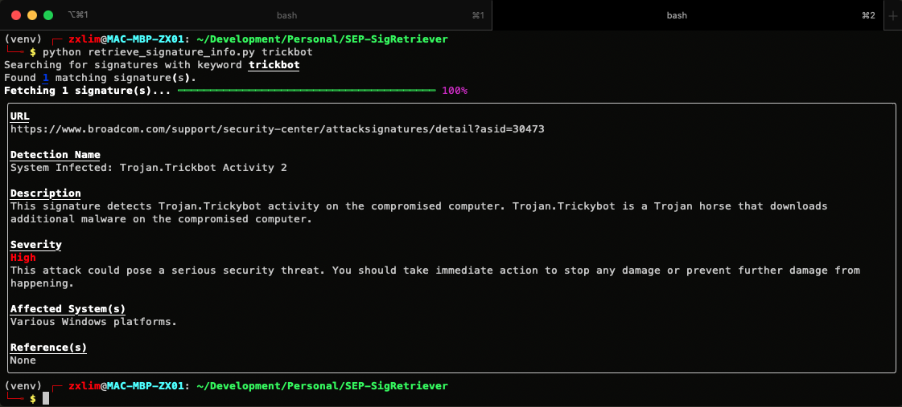

# SEP Signature Retriever
A proof of concept Python script for querying a specified online resource for information regarding Symantec's signature detections.



## Setup
Clone the repository and install the required Pip packages. Using a virtual environment is highy recommended.
```bash
# Clone the repository.
$ git clone https://github.com/zxlim/SEP-SigRetriever.git

# Setup the virtual environment.
$ virtualenv --python=python3 venv
$ source venv/bin/activate

# Install pip packages.
$ pip install -r requirements.txt
```

## Usage
```bash
# Display help:
$ python retrieve_signature_info.py -h

# Example usage:
$ python retrieve_signature_info.py --limit 1 "Ransom.Wannacry Dropper Activity"
$ python retrieve_signature_info.py OpenCandy
```

## License
This project is licensed under the [MIT License](LICENSE).
